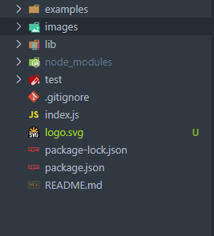

# Mod10Challenge-SVGLogoMaker

  ## Table of Contents
  - [Description](#Description)
  - [Installation](#Installation)
  - [Tests](#Tests)
  - [Images](#Images)

  ## Description
  This application is able to generate a basic logo as a SVG file. The logo the application generates can only contain up to 3 characters and must be either a triangle, a square, or a Circle. The logo can be made with any color name or by using hexidecimal code.

  ## Installation
  In order to get the application running properly you must first run 'npm i' to obtain the proper dependencies.

  ## Tests
  In order to run the  test files run 'npm test' in the terminal.

  ## Images
  The following is an example of the prompts with a given input. \
   \
  Here is what the SVG of that given input would look like. \
   \
  Additionally this image shows the newly generated SVG file. \
   \
